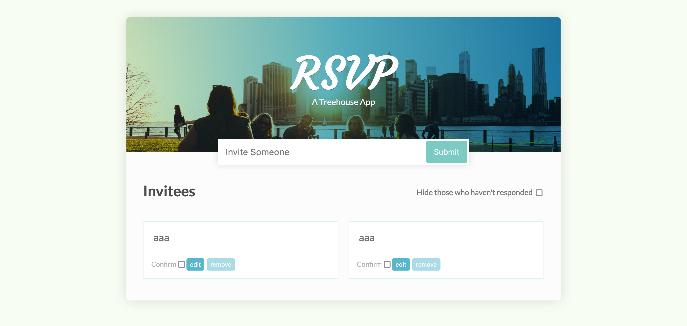

# Treehouse - RSVP App solution

This is a solution to the [RSVP App challenge on Treehouse](https://teamtreehouse.com/library/dom-scripting-by-example)

## Table of contents

-  [Overview](#overview)
   -  [The challenge](#the-challenge)
   -  [Screenshot](#screenshot)
   -  [Links](#links)
-  [My process](#my-process)
   -  [Built with](#built-with)
   -  [What I learned](#what-i-learned)
   -  [Continued development](#continued-development)
   -  [Useful resources](#useful-resources)
-  [Author](#author)

## Overview

### The challenge

Your users should be able to:

-  Enter a guests name & create a new response card based on their input
-  Toggle the visibility of guests that have not yet responded
-  Confirm whether individual guests have responded
-  Update the name of guests who have responded
-  Remove guests from the list who no longer wish to attend

### Screenshot



### Links

-  Live Site URL:

## My process

### Built with

-  Semantic HTML5 markup
-  Flexbox
-  CSS Grid
-  Mobile-first workflow
-  Vanilla JS

### What I learned

```html
<script defer src="app.js" type="text/javascript"></script>
<!-- defer -->
```

It was during this project where I first learnt about the different ways of loading Javascript in co-ordination with the rest of the HTML. By default, the HTML parser will load every resource and asset it encounters immediately before moving onto the next line, which will be very inefficient in larger projects where the amount of data to load will significantly increase. The 'defer' attribute allows the parser to completely finish loading all other markup and external resources whilst downloading the script, before ultimately returning to execute it once everything else is complete.

```css
li input[type='text']:enabled {
   border: 1px dotted rgba(0, 0, 0, 0.2);
}
```

I was further proud of my ability to chain together multiple different types of selectors, to be dynamic and yet specific in my styling of the text inputs inside each card. In the future it might be better to use descendant class selectors vs type selectors for greater specificity, but for a small project like this the outcome was as desired.

```js
 const functions = {
      edit: (target) => (target.textContent = 'save'),
      save: (target, localStorageArr, name, liIndex) => {
         target.textContent = 'edit'
         localStorageArr.splice(liIndex, 1, name)
         globalFunctions.jsonStringify(localStorageArr)
      },
   jsonParse: () => JSON.parse(localStorage.getItem('names')),
   jsonStringify: (localStorageArr) => {
      (localStorage.names = JSON.stringify(localStorageArr)),
    }
}

functions[target.innerText](target, localStorageArr, name.value, liIndex)
```

```js
localStorageArr ? value(name, localStorageArr) : value(name, txtInput.value)
```

Ternary -

```js
name.setAttribute('disabled', 'disabled')
// 1st time using this method - next time do as boolean (shorter)
```

The 'functions' object above was a great technique I implemented to refactor how I stored logic relating to certain aspects of the app, instead of openly declaring the functions in the global scope which would result in more bloated code.

Furthermore, this project was my first introduction to Local Storage in the browser, and how we can take advantage of it to save the state of our app between different sessions. Naturally this also provided a great introduction to the JSON data format, which essentially converts any data into a string to be successfully stored. Therefore we have to parse that data back into a non-JSON format to be used again throughout our app, using the conveniently named built in JSON constructor function.

### Continued development

CSS - Not overusing type selectors (not specific)

Greater use cases for local storage + always thinking about using it

### Useful resources

-  [Fastest Way to Load Javascript](https://www.youtube.com/watch?v=BMuFBYw91UQ&ab_channel=WebDevSimplified) - This informed me about different ways of loading JS. Async vs Defer vs normal (+ HTML parsing logic). Modules defer by default - use in later projects.

-  [Cookies vs Local Storage vs Session Storage](https://www.youtube.com/watch?v=GihQAC1I39Q&ab_channel=WebDevSimplified) - This informed me about different ways of storing data via JS in the browser.

## Author

-  Website - [Joshua Jameson-Wallis](https://joshuajamesonwallis.com)
-  Linkedin - [Joshua Jameson-Wallis]()

###### TODO

CSS:

Disabled input styling (greyed out) - txt input on RSVPs to change their name

Confirmed checkbox - blue outline (good boolean logic practice) | first 'filtering' logic practice - hide containers whose checkbox isn't in a checked (truthy) state

Edit btn text content changing when clicked (doesn't have to be based off whether input in disabled state or not - usr will only click when change desired)

1st time layering gradient on top of bg-img

JS:

1st 'app' - heavy JS focus + usr interactity | submit btn for validation (str txt input) | most content built + appended via JS - naked starting HTML (handling that much content dynamically)

Regex - dynamic id (removing whitespace + - instead)

Local storage - 1st project | clear() + set() with key + get() | what to save - recernt searches + state of app specific (guests) | JSON data + built in methods (PARSE + STRINGIFY) | other methods of storing data - Session + Cookies (less common + security issues + Cookies long as hell)
